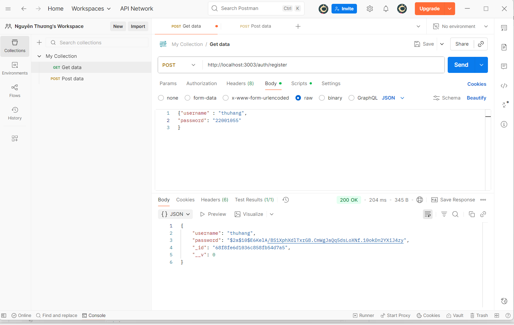
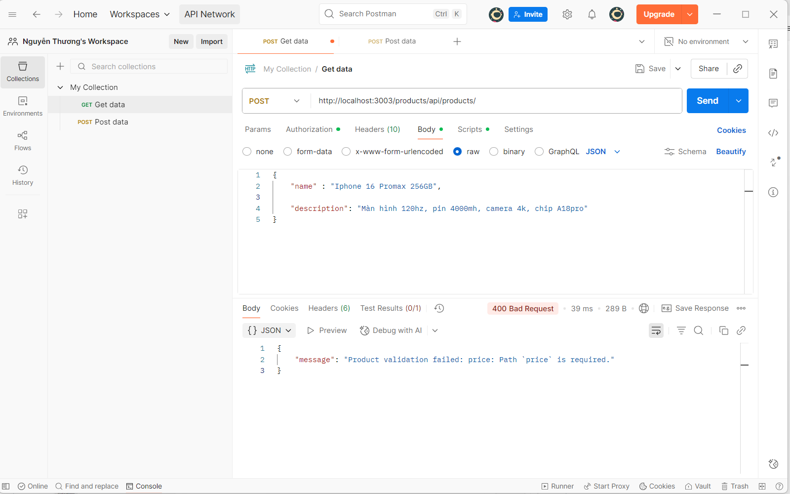
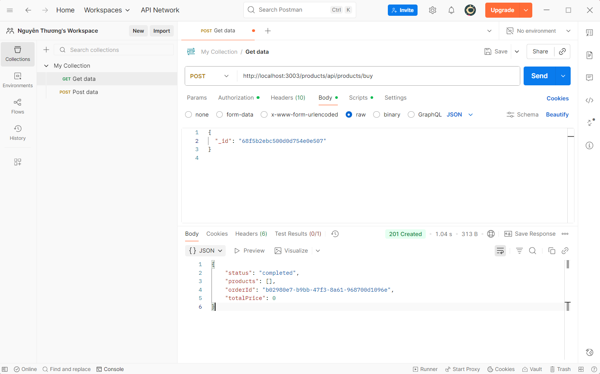
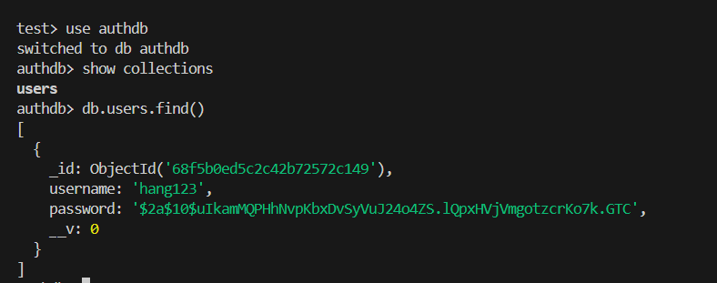
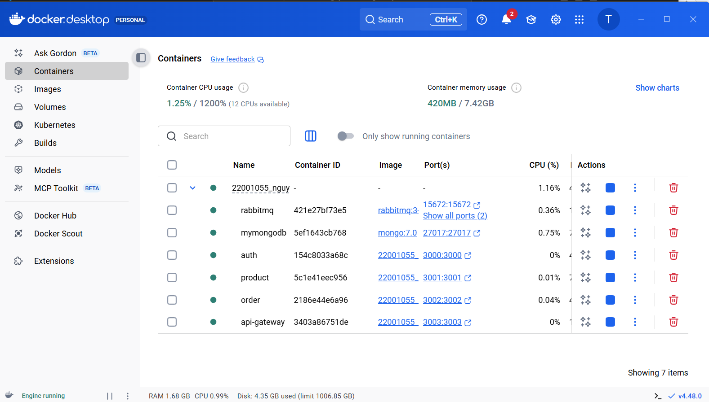
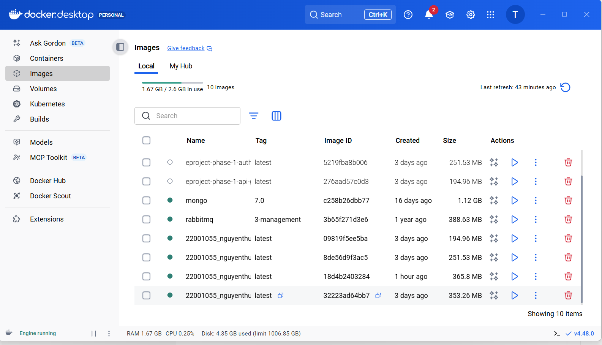

Download source code

Run npm install

Setup all microservices

Test all business logic with POSTMAN

-REGISTER

TRUONG HOP DA DANG KY TEN DO : {"message":"Username already taken"}

-LOGIN

-NHAP SAI USERNAME OR PASSWORD

CREATE PRODUCT

-ERROR CREATE PRODUCT

-GET DANH SACH PRODUCT

-Order

-

-SHOW MONGODB docker exec -it mymongodb mongosh

-USER

-PRODUCT

-ORDER

-docker ps

-docker-compose up --build

-docker

